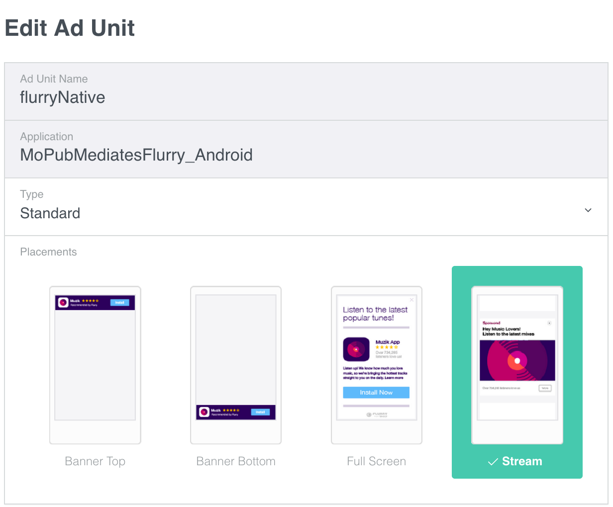

Flurry Android Adapter for MoPub
=================================

Adapter version 6.2.0 - Updated 2016-03-03
------------------------------------------

This version of the adapter works with MoPub Android SDK 4.1+ and Flurry Android SDK 6.2+. If using older versions of **both**
the MoPub and Flurry SDK, please refer to [version 5.4.0](https://github.com/flurry/FlurryAdapterForMoPubAndroid/tree/v5.4.0_for_mopub_pre_4.0.0) of the adapter. 
Otherwise, please upgrade to the newer versions of both SDKs.

###  Mediate Flurry Ads through MoPub

To integrate Flurry as the Custom Native Network in the MoPub ad serving flow, you need the
Custom Event Class code incorporated into your application in addition to the Flurry SDK.
Three quick steps are necessary:

1. Integrate the Flurry SDK and Flurry adapter for MoPub code into your app
2. Configure Flurry's Ad space(s)
3. Configure MoPub to mediate Flurry

#### Integrate the Flurry SDK and Flurry adapter for MoPub code into your app

1. If your application is not yet using Flurry analytics, create a new application on Flurry's
dev portal. After logging into https://dev.flurry.com , select the Applications tab and from the
top righthand corner select Add New Application. In case your application is already tracked
by Flurry, you can download the latest SDK from the adjacent top righthand
link.

    

2. Download the [Flurry Android SDK](https://dev.flurry.com/uploadVersionSelectProject.do).
Record the API Key found on the download page. This will identify your app in the Flurry system.

3. Add the Google Play Services SDK to your project. This is required for Android Advertising ID
support. See http://developer.android.com/google/playservices/setup.html.

4. Add the jar files from the Flurry SDK (FlurryAnalytics-6.x.x.jar and
FlurryAds-6.x.x.jar) to your project. Configure the build path of the project to include
the jar files.

5. Add the Flurry MoPub adapter classes (found in the [com.mopub.mobileads](src/com/mopub/mobileads)
& [com.mopub.nativeads](src/com/mopub/nativeads) package) to your project. Place the following
classes in com.mopub.mobileads:
    * [`FlurryCustomEventBanner`](src/com/mopub/mobileads/FlurryCustomEventBanner.java)
    * [`FlurryCustomEventInterstitial`](src/com/mopub/mobileads/FlurryCustomEventInterstitial.java)
    * [`FlurryAgentWrapper`](src/com/mopub/mobileads/FlurryAgentWrapper.java)

 Place the following classes in the com.mopub.nativeads package:
    * [`FlurryCustomEventNative`](src/com/mopub/nativeads/FlurryCustomEventNative.java)
    * [`FlurryStaticNativeAd`](src/com/mopub/nativeads/FlurryStaticNativeAd.java)

6. Follow the [MoPub Custom Event integration steps](https://github.com/mopub/mopub-android-sdk/wiki/Integrating-Third-Party-Ad-Networks)
for integrating banner and interstitial ads.

7. The steps to integrate Flurry Native Ads via MoPub are similar to those described [here](https://github.com/mopub/mopub-android-sdk/wiki/Native-Ads-Integration):
    * Create an XML layout for your native ads
    * Define where ads should be placed within your feed
    * Create a MoPubAdAdapter to wrap your existing `Adapter` subclass and begin loading ads.

 The broad range of assets that can be used in the `ViewBinder` are, again, similar to MoPub's.

8. If you plan to run [ProGuard](http://developer.android.com/tools/help/proguard.html) on your app
before release, you will need to add the following to your ProGuard configuration file.

 ```
 # Preserve Flurry
 -keep class com.flurry.** { *; }
 -dontwarn com.flurry.**
 -keepattributes *Annotation*,EnclosingMethod,Signature
 -keepclasseswithmembers class * {
     public <init>(android.content.Context, android.util.AttributeSet, int);
 }

 # Google Play Services library
 -keep class * extends java.util.ListResourceBundle {
     protected Object[][] getContents();
 }

 -keep public class com.google.android.gms.common.internal.safeparcel.SafeParcelable {
     public static final *** NULL;
 }

 -keepnames @com.google.android.gms.common.annotation.KeepName class *

 -keepclassmembernames class * {
     @com.google.android.gms.common.annotation.KeepName *;
 }

 -keepnames class * implements android.os.Parcelable {
     public static final ** CREATOR;
 }

 # Preserve GMS ads identifier classes
 -keep class com.google.android.gms.ads.identifier.** {*;}
 ```

#### Configure Flurry Ad space(s)

For each MoPub ad unit that you would like to mediate Flurry through, please create a matching ad
space on Flurry's dev portal ( http://dev.flurry.com ). Log into the developer portal and navigate
to the **Publishers** tab. On the lefthand navigation bar select **Inventory** and then
**Ad Spaces**.


With **Ad Spaces** selected you’ll see an index of previously created ad spaces. To set up a new one,
click on the **New Ad Space** button on the top right. The Ad Space setup screen has four modules.

The Basic Setup section includes fields required to define the name, application, dimensions,
placement and orientation of the ad space.



The basic setup is all you need for most integrations and you can click the "Save Ad Space" button.

Please note that mediating Flurry through MoPub requires no additional Flurry-related code.
The Flurry Advertising code is already incorporated in the com.mopub.mobileads and
com.mopub.nativeads package (added to your project in the previous step).

#### Configure MoPub to mediate Flurry

Flurry's custom events are implemented in accordance with [instructions provided by MoPub]( https://github.com/mopub/mopub-android-sdk/wiki/Custom-Events).

After you incorporate the Flurry files into your project, you need to
configure Flurry as a Custom Network. Please follow instructions provided by MoPub 
(for [banner, interstitial](https://dev.twitter.com/mopub/ui-setup/custom-network-setup) or [native](https://dev.twitter.com/mopub/ui-setup/network-setup-custom-native)) 
with any of the Flurry custom events class noted below:

* [`com.mopub.mobileads.FlurryCustomEventBanner`](src/com/mopub/mobileads/FlurryCustomEventBanner.java)
 for banner ads
* [`com.mopub.mobileads.FlurryCustomEventInterstitial`](src/com/mopub/mobileads/FlurryCustomEventInterstitial.java)
  for interstitial ads
* [`com.mopub.nativeads.FlurryCustomEventNative`](src/com/mopub/nativeads/FlurryCustomEventNative.java)
 for Flurry native ads

**NOTE:** An important step to get this integration working is to configure the custom network (as described above) with the
Flurry API key and Flurry Ad Space and send them as server extras (in the "Custom Event Class Data" field on the MoPub UI).

The custom event class data should be in the following JSON format:

```json
{"apiKey":"YOUR_API_KEY","adSpaceName":"AdSpaceName"}
```

You can also configure the custom event data as a line item in your MoPub order.


For full integration instructions to mediate Flurry through MoPub see
[here](https://developer.yahoo.com/flurry/docs/publisher/gettingstarted/mediation/mopubmediatesflurry/android/). 
For more info on getting started with Flurry for Android, see
[here](https://developer.yahoo.com/flurry/docs/analytics/gettingstarted/android/)
and for more info on monetizing you app through Flurry see
[here](https://developer.yahoo.com/flurry/docs/publisher/code/android/)

Changelog
---------
#### Version 6.2.0 - 2016-03-03
* Added Flurry ad branding logo as a MoPub extra

#### Version 6.1.0 - 2015-10-12
* Added support for MoPub 4.0.0

##### Version 5.4.0.r1 - 2015-04-05
* Flurry Native Ad usage in Listview has the entire ad clickable.
* Allow Flurry Native Ad without any image.

##### Version 5.1.0.r1 - 2015-02-02
* Introduced Flurry Native Ad support in the adapter
